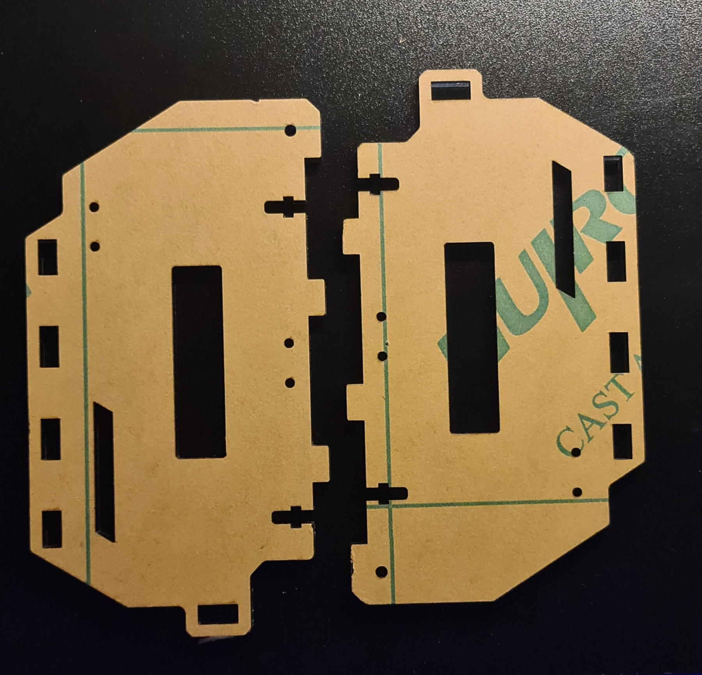
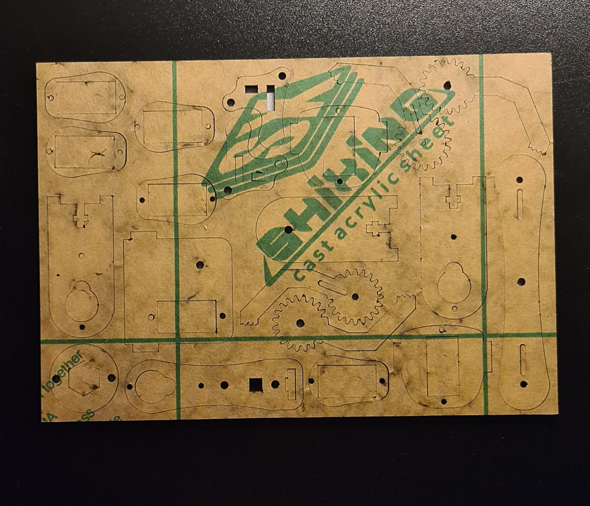

# RaspTank Project Notes.

Day 1: Unboxing, Parts Layout & Image Uploading.

    Unpack everything and lay out the chassis, motors, arm servos, Pi mount, camera, and hardware.

    Take images of all parts, rename images to correct naming scheme, upload images to GitHub repo.    

1. **Kit Box**  
   

2. **Micro Servos (6×)**  
   

3. **Electronic Components (sensors, headers, screws)**  
   

4. **Tank Tracks & Battery Holder**  
   

5. **Pi Camera Ribbon & Camera**  
   
   
6. **Driver Board & Batterys**  
   
   
7. **Toolkit & Connection Cables**  
   

8. **Side Panels**  
   

9. **Bottom Plate**  
   

10. **Top Plate**  
   

11. **Gear Cutouts**  
    

12. **Arm Frame Pieces**  
    

Day ?: Assembly.

    Assemble the tank tracks and motor brackets—follow the Adeept manual step by step.

    Mount the 4-DOF arm onto the chassis. Snug everything down, but don’t over-tighten.

    Attach the Raspberry Pi to the chassis, camera module, and the motor-driver board via the GPIO header.

Day ?: Flash & Boot the Pi.

    Flash Raspberry Pi OS Lite (or Desktop if you like a GUI) onto your microSD with Raspberry Pi Imager.

    Enable SSH & Wi-Fi by dropping an empty ssh file and a wpa_supplicant.conf onto the boot partition.

    First boot: SSH in, update the system (sudo apt update && sudo apt full-upgrade), and reboot.

Day ?: Python Environment & Motor Test.

    Create a project folder on the Pi (~/rasptank) and a Python venv (python3 -m venv .venv).

    Install dependencies:

    source .venv/bin/activate
    pip install RPi.GPIO adafruit-circuitpython-servokit flask

    Write a quick script to spin each motor forward/back so you know your wiring is correct. Commit it to a simple Git repo.

Day ?: Robotic Arm Control.

    Install the ServoKit library (it handles I²C PWM for your 4-DOF arm).

    pip install adafruit-circuitpython-servokit

    Experiment in Python REPL to move each joint a few degrees. Build a small “arm.py” module of functions like lift_gripper(), lower_arm(), etc.

Day ?: Camera & OpenCV Setup.

    Enable the camera interface (sudo raspi-config) and reboot.

    Install OpenCV (there are quick builds on Pi or use pip install opencv-python-headless).

    Test a webcam capture script that shows your camera feed and can take snapshots.

Day ?: Target Tracking & Web Control.

    Combine the arm & camera: write an OpenCV loop that detects a colored object (say, a red ball) and prints its X/Y.

    Map X/Y to simple pan/tilt motions on your arm or skid-steer motors.

    Optional: Spin up a tiny Flask server with endpoints like /forward, /left, /arm/up, letting you drive the tank from a phone browser over Wi-Fi.

Notes On Build & Progress.